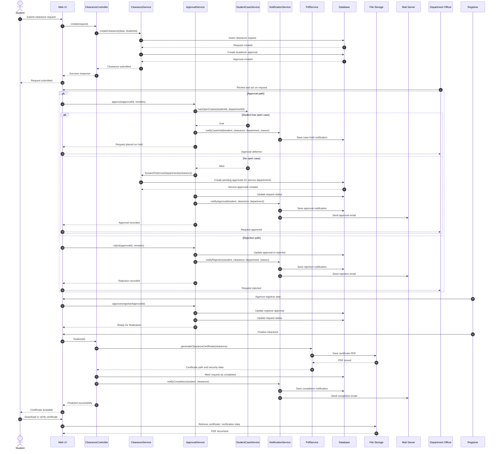

# Clearance System Sequence Diagram

```mermaid
sequenceDiagram
    autonumber
    actor Student
    participant UI as Web UI
    participant ClearanceController
    participant ClearanceService
    participant ApprovalService
    participant StudentCaseService
    participant NotificationService
    participant PdfService
    participant Database
    participant Storage as File Storage
    participant Mail as Mail Server
    participant Department as Department Officer
    participant Registrar

    Student->>UI: Submit clearance request
    UI->>ClearanceController: create(request)
    ClearanceController->>ClearanceService: createClearance(data, studentId)
    ClearanceService->>Database: Insert clearance request
    Database-->>ClearanceService: Request created
    ClearanceService->>Database: Create academic approval
    Database-->>ClearanceService: Approval created
    ClearanceService-->>ClearanceController: Clearance submitted
    ClearanceController-->>UI: Success response
    UI-->>Student: Request submitted

    Department->>UI: Review and act on request

    alt Approval path
        UI->>ApprovalService: approve(approvalId, remarks)
        ApprovalService->>StudentCaseService: hasOpenCases(studentId, departmentId)

        alt Student has open case
            StudentCaseService-->>ApprovalService: true
            ApprovalService->>NotificationService: notifyCaseHold(student, clearance, department, reason)
            NotificationService->>Database: Save case-hold notification
            ApprovalService-->>UI: Request placed on hold
            UI-->>Department: Approval deferred
        else No open case
            StudentCaseService-->>ApprovalService: false
            ApprovalService->>ClearanceService: forwardToServiceDepartments(clearance)
            ClearanceService->>Database: Create pending approvals for service departments
            Database-->>ClearanceService: Service approvals created
            ApprovalService->>Database: Update request status
            ApprovalService->>NotificationService: notifyApproval(student, clearance, department)
            NotificationService->>Database: Save approval notification
            NotificationService->>Mail: Send approval email
            ApprovalService-->>UI: Approval recorded
            UI-->>Department: Request approved
        end
    else Rejection path
        UI->>ApprovalService: reject(approvalId, remarks)
        ApprovalService->>Database: Update approval to rejected
        ApprovalService->>NotificationService: notifyRejection(student, clearance, department, reason)
        NotificationService->>Database: Save rejection notification
        NotificationService->>Mail: Send rejection email
        ApprovalService-->>UI: Rejection recorded
        UI-->>Department: Request rejected
    end

    Registrar->>UI: Approve registrar step
    UI->>ApprovalService: approve(registrarApprovalId)
    ApprovalService->>Database: Update registrar approval
    ApprovalService->>Database: Update request status
    ApprovalService-->>UI: Ready for finalization

    Registrar->>UI: Finalize clearance
    UI->>ClearanceController: finalize(id)
    ClearanceController->>PdfService: generateClearanceCertificate(clearance)
    PdfService->>Storage: Save certificate PDF
    Storage-->>PdfService: PDF stored
    PdfService-->>ClearanceController: Certificate path and security data
    ClearanceController->>Database: Mark request as completed
    ClearanceController->>NotificationService: notifyCompletion(student, clearance)
    NotificationService->>Database: Save completion notification
    NotificationService->>Mail: Send completion email
    ClearanceController-->>UI: Finalized successfully
    UI-->>Student: Certificate available

    Student->>UI: Download or verify certificate
    UI->>Storage: Retrieve certificate / verification data
    Storage-->>UI: PDF document
```
